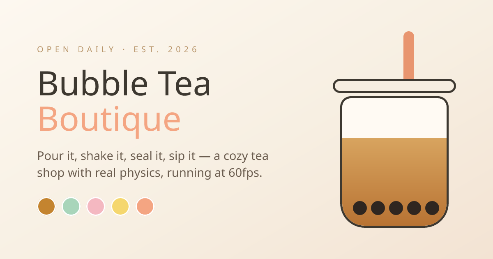

<div align="center">

# 🧋 Bubble Tea Boutique



**A cozy little tea shop that happens to run at 60fps.**

Pour it, shake it, seal it, sip it. Every cup is a real 3D object with real physics —
pearls that actually fall, ice that actually clinks, a lid that actually snaps shut.

### [☕ Visit the shop →](https://bubbletea-shop.yazmin.dev)

[](https://github.com/YOUR_USERNAME/YOUR_REPO/actions/workflows/ci.yml)


</div>

---

## ☕ First, the vibe

Most e-commerce demos are a grid of cards and a checkout button. This one is a
**place**. You walk in through the porch, browse a fridge, brew your own cup at
the counter, and shake your tote bag to pay.

The whole shop is built around one idea: **an interface can be warm.** No pure
black text. No harsh shadows. Nothing snaps — it settles, with spring physics
doing the easing. There's an ASMR toggle. There's a day shift and a night shift.
There's a mascot in the sidebar who boings when you poke them.

It is, as the About page puts it, frontend engineering dressed up as a hug.

---

## 🗺️ Take the tour

The shop has its own vocabulary — the nav doesn't say "Home" and "Cart."

| Room | Route | What happens there |
|:--|:--|:--|
| 🏠 **The Porch** | `/` | 3D hero cup. Pick a flavor, watch the liquid actually change color and the cup spin with weighted deceleration. |
| 🧋 **The Fridge** | `/menu` | A 3D café counter you glide along. Polaroid cards scatter across it; pick one up to order. |
| 🧪 **Brew Your Own** | `/brew` | **The main event.** Build a drink from nothing — see below. |
| 📖 **Our Diary** | `/about` | The shop's story. |
| 🧺 **My Tote Bag** | `/basket` | Cart with a live total — and a checkout you *shake*. |
| 💗 **Saved Sips** | `/favorites` | Everything you've hearted. |
| 🍵 **Drink detail** | `/drink/:id` | One cup, fully interactive, with customization. |

---

## 🧪 The Brew Bar

This is the piece worth opening first. `/brew` gives you an empty cup and a set
of controls, and nothing is faked:

- **Drop pearls** — real `cannon-es` rigid bodies, spawned on a golden-angle
  spiral above the rim so no two ever spawn overlapping. (Overlapping spawns are
  what made early builds violently eject pearls across the room.)
- **Pour the tea** — the liquid rises in ticks, glugging as it goes.
- **Add ice** — cubes tumble in and clink off each other.
- **Seal it** — the lid snaps on and the straw drops through, and your cup rests
  finished until you hit Redo.

Then take it to the tote bag and **shake the drink to check out** — the app reads
accumulated shake energy and, past a threshold, fires the confetti.

---

## 🔊 Everything makes a sound

There's a small synthesized sound library (`src/lib/sounds.ts`) — no audio files,
all generated with the Web Audio API. Ice clinks, pearls tap, the crank spins,
the pour glugs, stickers slap, the mascot boings.

All of it is **off by default** and lives behind the `🔊 ASMR` toggle in the
sidebar, right under the `☀️ Day shift` / `🌙 Night shift` switch. Both
preferences persist to `localStorage`.

---

## 🚀 Run it

Requires **Node 18.18+**.

```bash
git clone https://github.com/YOUR_USERNAME/YOUR_REPO.git
cd YOUR_REPO
npm install
npm run dev
```

Open **[localhost:3000](http://localhost:3000)** and you're in the shop.

> **No environment variables, no API keys, no database.** The entire boutique
> runs client-side — your cart, favorites, and vibe settings live in
> `localStorage`. Clone and go.

<details>
<summary><b>Other scripts</b></summary>

| Command | What it does |
|:--|:--|
| `npm run dev` | Dev server with Turbopack |
| `npm run build` | Production build (also runs ESLint + type-checking) |
| `npm run start` | Serve the production build |
| `npm run lint` | ESLint on its own |
| `npm run optimize-model` | Draco-compress a source `.glb` |
| `npm run generate-cup` | Generate a typed R3F component from the `.glb` |

</details>

---

## 🏗️ How it's put together

```
src/
├── app/              # Next.js App Router — one folder per room
├── components/
│   ├── three/        # Shared 3D: cups, counter, aura, floating ingredients
│   ├── brew/         # The Brew Bar — canvas, scene, physics
│   ├── menu/         # The Fridge — gliding counter + polaroid scatter
│   ├── layout/       # App shell, receipt sidebar, footer
│   └── nav/          # Sidebar mascot, wiggly text
├── context/          # Shop (cart/favorites), Brew, MenuCounter, Vibe
└── lib/              # Drinks data, physics helpers, sounds, storage
```

**Four contexts, four concerns.** `ShopProvider` owns cart and favorites and
mirrors them to `localStorage`; `cartTotal` is derived, never stored. `BrewContext`
owns the cup being built. `MenuCounterContext` tracks your position along the
counter. `VibeContext` owns day/night and sound preferences.

**Hydration is handled deliberately.** Persisted state loads in a mount effect and
only writes back once `hydrated` is true — so the first render always matches the
server and React never yells about a mismatch.

---

## 🎨 The design rules

A few constraints applied everywhere, which is most of why it feels cohesive:

- **Never pure black.** Body text is warm brown `#3d3830`.
- **Shadows are peach-tinted**, not gray — `.shadow-warm`, `.card-warm`.
- **Buttons are pills** and lift on hover — `.btn-pill`.
- **Nothing snaps.** Framer Motion handles page transitions via `template.tsx`;
  `@react-spring/three` handles the heavy, premium deceleration on 3D rotations.
- **Shadows are baked**, not real-time — Drei's `<ContactShadows>` gives soft
  contact blur at a fraction of the cost.

---

## 🧊 Bringing your own 3D model

The shop ships with a hand-built cup (`BobaCupModel.tsx`) that mirrors gltfjsx's
output structure, so **it runs out of the box with no assets**. To swap in a real
model:

1. Drop your `boba-cup.glb` in `public/models/source/`.
2. `npm run optimize-model` → Draco-compresses it to `public/models/boba-cup-draco.glb`.
3. `npm run generate-cup` → generates a typed `BobaCupGenerated.tsx`.
4. **Name your liquid mesh `Liquid`** (or `liquid` / `drink` / `tea`).
   `findLiquidMesh()` finds it and drives `material.color` from flavor state.

---

## ☁️ Deploy

**Live:** [bubbletea-shop.yazmin.dev](https://bubbletea-shop.yazmin.dev)

Push to GitHub, then import the repo at [vercel.com](https://vercel.com) (or
point your own domain at it). Next.js is detected automatically — no
configuration, no env vars.

Sanity-check the production build locally first:

```bash
npm run build && npm run start
```

---

## 🛠️ Built with

[Next.js 15](https://nextjs.org) · [React 19](https://react.dev) ·
[React Three Fiber](https://docs.pmnd.rs/react-three-fiber) ·
[Drei](https://github.com/pmndrs/drei) · [cannon-es](https://github.com/pmndrs/cannon-es) ·
[React Spring](https://www.react-spring.dev) · [Framer Motion](https://www.framer.com/motion/) ·
[Tailwind CSS v4](https://tailwindcss.com) · Web Audio API

---

<div align="center">

**MIT licensed** — take it, remix it, open your own shop. ☕

</div>

